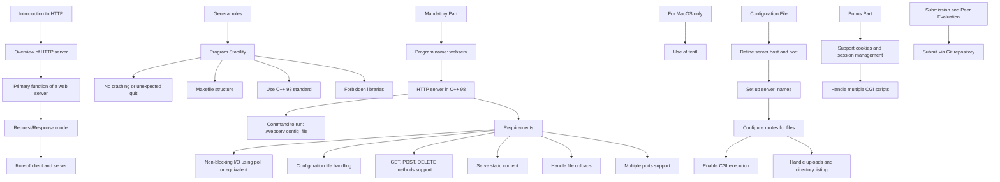

# webserv
This is when you finally understand why a URL starts with HTTP

```mermaid
flowchart TD
    A[Introduction to HTTP] --> B[Overview of HTTP server]
    B --> C[Primary function of a web server]
    C --> D[Request/Response model]
    D --> E[Role of client and server]
    
    A1[General rules] --> F[Program Stability]
    F --> G[No crashing or unexpected quit]
    F --> H[Makefile structure]
    F --> I[Use C++ 98 standard]
    F --> J[Forbidden libraries]
    
    A2[Mandatory Part] --> K[Program name: webserv]
    K --> L[HTTP server in C++ 98]
    L --> M[Command to run: ./webserv config_file]
    L --> N[Requirements]
    N --> O[Non-blocking I/O using poll or equivalent]
    N --> P[Configuration file handling]
    N --> Q[GET, POST, DELETE methods support]
    N --> R[Serve static content]
    N --> S[Handle file uploads]
    N --> T[Multiple ports support]
    
    A3[For MacOS only] --> U[Use of fcntl]
    
    A4[Configuration File] --> V[Define server host and port]
    V --> W[Set up server_names]
    W --> X[Configure routes for files]
    X --> Y[Enable CGI execution]
    X --> Z[Handle uploads and directory listing]
    
    A5[Bonus Part] --> AA[Support cookies and session management]
    AA --> AB[Handle multiple CGI scripts]

    A6[Submission and Peer Evaluation] --> AC[Submit via Git repository]
```
